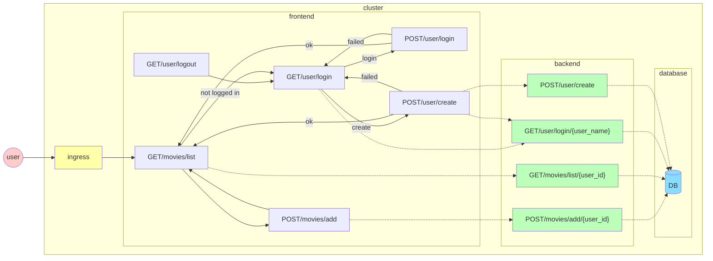

# Application
## Description
This is a website for people to enter a list of movies they would like to watch.
Future functionality might allow one to search for other users that have movies in common on their watch lists.

## Design
The application is intentionally simplistic so the focus can be on the surrounding activities, rather than the application itself.  This is not intended to be a useful application in its current state.

The end-user visible functions implemented are:
user login - log into the system with a username that has been previously registered.  No password is required.
new user - Register a new user.  As long as the user name is unique, the user account is created and the user is logged in.
logout - Log out of user account.
list movies - show the list of movies associated with the currently logged in user
add movie - add a new movie to the list of movies for the currently logged in user

The application front and back ends are written in Python using Flask.

### Application structure

The application is broken into three tiers.  A web front end tier that renders html pages, a middleware tier with microservices defined by the API, and a data storage tier.

### Web site (front end) routes

- GET / redirects to GET /movies/list
- GET /movies/list will show the movie list of the logged in user.  If no user is logged in, will redirect to GET /user
- GET /user/login displays a form for the user name and login (POST /user/login) and create (POST /user/create) buttons.
- POST /user/login attempts to log in as the given user.  It is an error to try to log in as a user that does not exist, or with a username that is improperly formatted.  If the login is successful, set up the session information and redirect to / (which then redirects to the default place for logged in users).  If there is an error, GET /user/login with the error displayed.
- POST /user/create attempts to create the given user.  It is an error to try to create a user that already exists, or to use invalid formatting for the name.  If the create is successful, it will perform the authentication actions identical to POST /user/login, and will redirect to / (which will then redirect somewhere else).  If there is an error, GET /user/login with the error.
- GET /user/logout will log out the current user by destroying the user session and redirect to GET /user

### backend API
Note, there is overlap between the routes on the website and the API paths.  These are not the same thing.  The API is not accessible from the outside, and can only be called by the front end (not currently enforced).
#### User
- GET /user/login/{user_name}.  Will attempt to log in with the given credentials and return a user session token that embeds the user JSON object.  Initially, credentials are only a user name with alphabetic and numeric characters (no password)
- POST /user/create will create login if the name is not already taken.  Input is JSON user document with name filled in.  Creating a user consists of providing a valid user name (alphabetic and numeric characters) 
#### Movies
- GET /movies/list/{user_id} - will show a list of a user's movies.
- POST /movies/add/{user_id} - POST will add a movie to the given user's list.  Movie name can be string of any ASCII printable characters.  Note that movie names do not need to be unique (there is no separate movie table in the data store)
### Diagram

### Data storage
Users and movie lists are stored in a PostgreSQL database.
The database is destroyed every time a new version of the application is rolled out.
This is a simplification, as database migrations and upgrades is not the focus of this project.

## Status
The application front end, back end services, and database have been implemented and automated test suites have been written.

### Front end
The base location for for the front end is in [chiller/frontend](https://github.com/lago-morph/chiller/frontend).  The following files and subdirectores under this base:
- chiller_frontend - python code and html templates
- tests - unit tests using pytest
- integration_tests - integration tests using pytest
- browser_tests - browser end-to-end tests using Selenium (drives scripted tests using Chrome browser)
- Dockerfile - for building frontend container
- requirements.txt, test-requirements.txt - used to set up python package environments for development and testing
 
### Back end
The base location for for the back end is in [chiller/api](https://github.com/lago-morph/chiller/api).  The following files and subdirectores under this base:
- chiller_api/{controllers, db, models} - python code 
- chiller_api/db/schema.sql - database schema
- chiller_api/tests - unit tests using pytest
- Dockerfile - for building frontend container
- requirements.txt, test-requirements.txt - used to set up python package environments for development and testing
  
### SDK
This is the Python code generated by Swagger Codegen to call the backend APIs.
The base location for for the SDK is [chiller/sdk](https://github.com/lago-morph/chiller/sdk).  The following files and subdirectores under this base:
- chiller_api_client - auto-generated python code by Swagger Codegen
- docs - auto-generated by Swagger Codegen
- test - auto-generated by Swagger Codegen.  Not used.
- integration_test - integration test cases to exercise the api using pytest
- requirements.txt, test-requirements.txt - used to set up python package environments for development and testing
  
