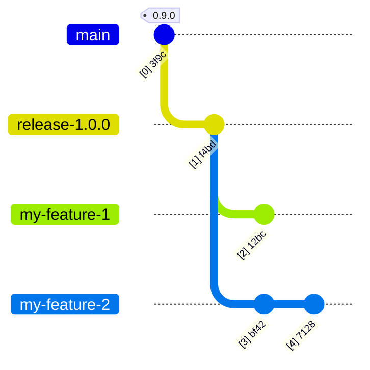
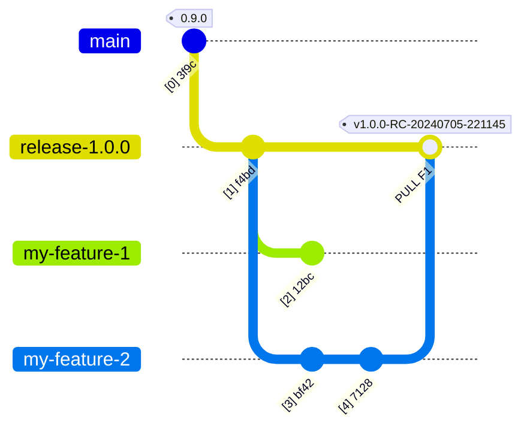
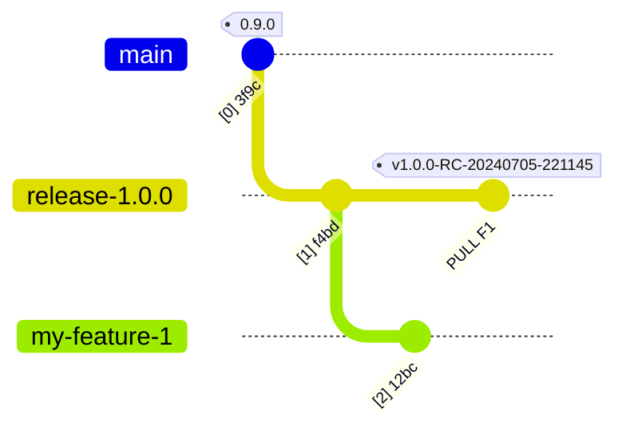
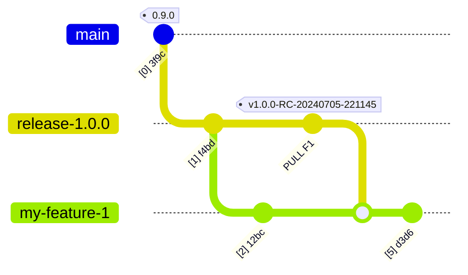
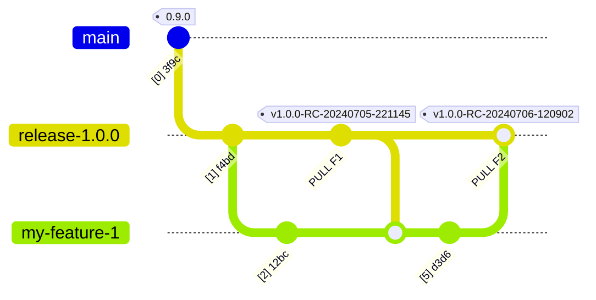
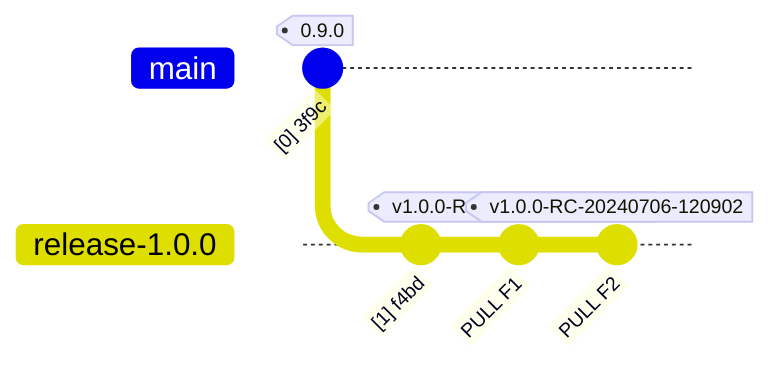
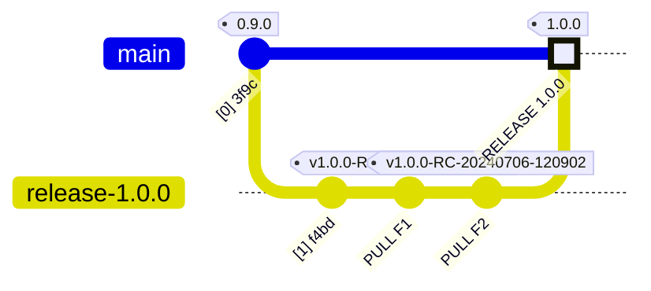
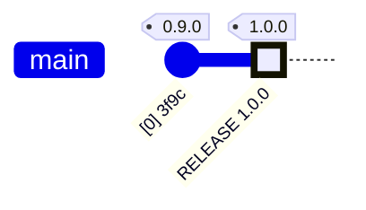
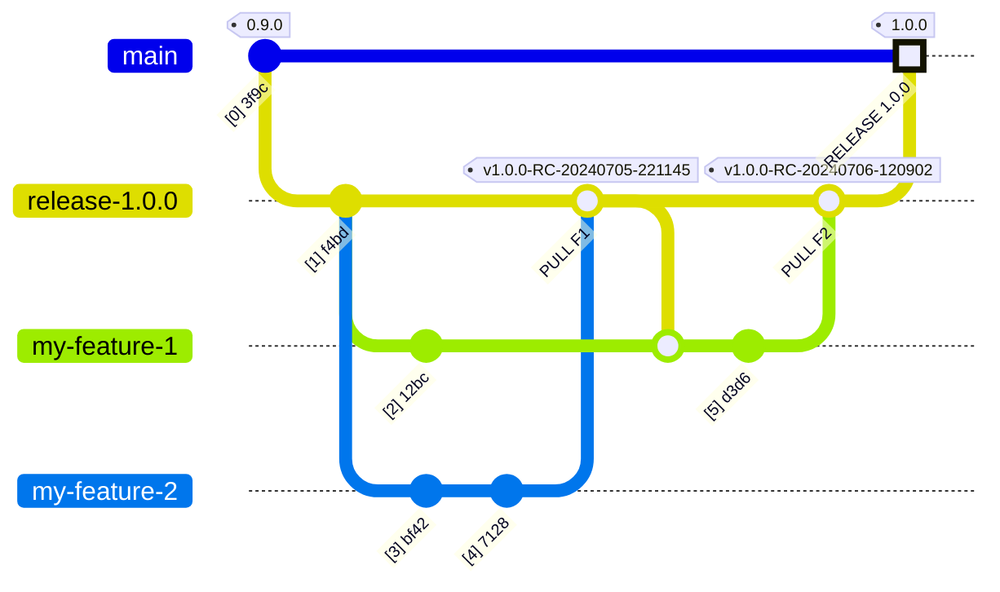

# Overview of Continuous Integration, Delivery, and Deployment
Automated CI/CD will be handled by using GitHub Actions.  We will handle:
- Continuous integration (check that automated unit and integration tests are successful)
- Continuous delivery (build artifacts ready for deployment and make them available in a central location)
- Continuous deployment (automatically deploy new releases into production, on-demand creation and tear-down of private production-like versions of the application)
When necessary I will distinguish between the two Ds by specifying CI/CD(elivery) or CI/CD(eployment).

## Branches
There are three types of branches:
- main - single protected branch for code deployed to production.  Can only be modified by pull requests and their associated github actions.
- release-a.b.c - protected branch for a planned upcoming release.  Can only be modified with pull request which triggers CI/CD(elivery) process for code to be merged
- feature releases - anything not named main or release-* - ephemeral, deleted after merging
Pushes to main and release-* are not allowed to enforce the use of pull requests.
Pull requests to main can only come from branches named release-*.

## CI/CD triggers
- Creating a pull request into a release-a.b.c branch triggers the CI process.
- Closing a pull request (merge) into a release-a.b.c branch triggers the CD(elivery) process.
- Creating a pull request into a main triggers the install testing part of the CD(elivery) process.
- Closing a pull request (merge) into main triggers deployment into production.  The production deployment is monitored and automatically rolled back if certain metrics are out of bounds.
- Creating an issue with a specially crafted name will trigger creation of various types of test environments in a release-* branch.

## Components
The overall system consists of the following components:
- Back-end api services
- Front end user interface
- Helm chart for deploying application
  - parameterized for various types of deployment tests and production rollout

Automated tests are defined for each component.
For the front and back end components this consists of unit tests, integration tests, and system tests (browser test).
Tests for the front and back end are run during the CI process.

For the Helm chart this consists of initial deployment, upgrade deployment, and load tests.
These tests can be triggered by a developer on code already merged into the release branch, and are automatically run when a pull request is created to merge code from a release branch into main.
For initial deployments the application is installed into a newly-created namespace and post-install sanity checks are run.
Upgrade deployments are like initial deployments, except, first the version of the application currently running in the production environment is installed in the newly-created namespace, and then an upgrade is run with the current release candidate in the release branch.
Load tests follow the same process as an initial deployment, but also runs a load test against the installed application using Locust.

# Example
We start by creating branch release-1.0.0 from main.  
We update the readme and some other files, and commit it as a starting point for development.
We actually do this by creating a feature release, a pull request, and approve the pull request.
That will trigger the CI and CD(eployment) process which builds containers.
These containers will be available if we want to trigger deployment or system test environments in our release branch.  
Those on-demand system test and deployment test features will only be available after the first pull request is approved into the release branch.

## Development commences
Two different developers are working on features for this release.  Then branch off the release branch, and start making changes

## Feature merged into release branch
One of the developers finishes their feature, and issues a pull request into the release branch.  
This triggers the CI process through integration testing and package/container creation.  
If those checks are good, and the pull request is approved, it is merged into the release branch and the developer is free to delete the feature branch.
The CD artifacts are then published with the tags assigned to this merge.

When the pull request is created, it will will run the CI/CD(elivery) actions.
The pull request cannot be approved until the CI/CD run is successful.
At the end of a successful run the containers will be uploaded to ghcr.io, and tagged with an identifier we can use to retrieve them later (in the example below, `v1.0.0-RC-20240705-221145`).
If code is changed in the pull request (e.g., fixing something requested during the discussion), the CI/CD run goes again.  
If the pull request is approved, a git tag is created on the merge commit that corresponds to the containers that were built with the approved source code.

## The my-feature-2 branch is now deleted

## On-demand deployment testing
At any time, deployment tests can be triggered in a release branch by opening a GitHub issue with a specially crafted name.  
This causes a deployment test to be run in a temporary namespace in the testing kubernetes cluster.
Any of the three delopment tests (initial, upgrade, load) can be run.
The Action that executes the deployment test will find the most recent github tag in this branch with the appropriate format (`v1.0.0-RC-*`) and use that to find the appropriate container images.
If the tests are successful the application is removed from the test environment, the temporary namespace is deleted, logs are associated with the GitHub issue that triggered the test, and the issue is closed.  
If one of the tests is not successful, logs associated with the test are attached to the GitHub issue that triggered the test, and the application and namespace are left intact so that the problem can be debugged.  
When the GitHub issue associated with a failed test is resolved, an Action is triggered that removes the instance of the application and the temporary namespace from the test environment.

## Continued development
If needed, the other developer merges the updated release branch into their feature branch and continues working.

## Second feature merged
The process repeats for the other feature.  A pull request is started, the CI/CD(elivery) process runs, and if the PR is approved, it is merged.  CD artifacts are then released, and a new tag is created on the on the branch.

## The feature-1 branch can now be deleted

## Pull request into main
A pull request is created into main using the tag for a release candidate.  This triggers all three deployment tests, initial, upgrade, and load.
These tests must pass before the pull request can be approved.  
As with the on-demand CI/CD(eployment) tests, the installed application and namespaces are deleted if the test is successful, and is retained (with a new issue created) when they fail.  
The application install and associated namespace for a failed deployment test are automatically deleted when the GitHub issue related to the failed deployment is closed.

## The release is finalized
The pull request into main is approved, triggering automatic deployment into production.  
If the automatic deployment fails, it is rolled back, an issue is created, and the merge is rolled back.  If automatic deployment succeeds, the merge is tagged as the release number and the release branch can then be deleted.

## The release-1.0.0 branch can now be deleted

## Full process with all branches

